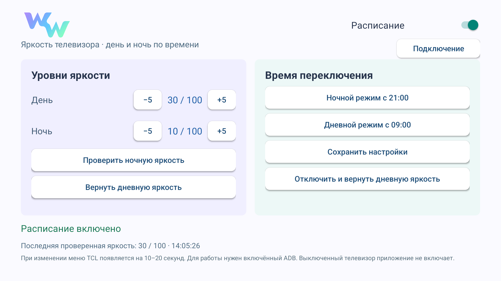

# WWave

Real TCL TV brightness on a daily schedule. Android TV app with a remote-friendly settings screen and a pastel WW monogram.

**[Download the signed APK](https://github.com/natural0101/wwave/releases/download/v1.6/WWave-1.6.apk)** · [Release notes](https://github.com/natural0101/wwave/releases/tag/v1.6)



## Что делает приложение

WWave меняет яркость в штатном меню TCL. Ночной режим по умолчанию работает с **21:00 до 09:00**: ночью **10/100**, днём **30/100**. Время и оба уровня можно изменить в приложении.

На одном экране есть переключатель расписания, выбор времени, проверка ночной яркости, возврат дневной яркости и кнопка **«Отключить и вернуть дневную яркость»**. Отключение отменяет таймеры и останавливает службу после возврата яркости.

## Совместимость

Это предварительный релиз для TCL с Android TV и русским меню **«Экран и звук → Изображение → Яркость»**. Проверено на TCL G10 / C6KS с Android 12. Минимальная версия для установки — Android 8; работа меню на остальных прошивках не подтверждена.

Приложение использует локальный ADB `127.0.0.1:5555`. При переключении штатное меню появляется примерно на 10–20 секунд, затем WWave пытается вернуть предыдущий экран. Если ожидаемое меню не найдено, приложение показывает ошибку. Нужны включённая сетевая отладка и разрешение на подключение. Компьютер после настройки не требуется.

Полная перезагрузка телевизора, HDMI/HDR-профили и другие языки меню пока не проверены. Выключенный телевизор приложение не включает.

## Установка и первое подключение

1. Скачайте `WWave-1.6.apk` из Releases и установите на телевизор. Можно передать файл на TV или установить с компьютера командой `adb install WWave-1.6.apk`.
2. Включите параметры разработчика и сетевую отладку ADB на телевизоре. Для этой версии нужен порт **5555**. Способ включения зависит от прошивки TCL; отладка с кодом сопряжения и случайным портом не поддерживается.
3. Откройте WWave и нажмите **«Подключение»**.
4. В системном запросе отладки выберите **«Всегда разрешать»**, затем **«Разрешить»**. При необходимости нажмите «Подключение» ещё раз и дождитесь сообщения об успешной проверке.
5. Установите уровни и время, сохраните настройки, проверьте ночной и дневной режимы. Затем включите расписание.

Каждая чистая установка создаёт собственный RSA-ключ в закрытом хранилище приложения. APK не содержит готовых ключей ADB. Обновление поверх существующей версии сохраняет настройки и авторизацию; удаление приложения удаляет его локальный ключ.

Если ваш launcher не показывает новую плитку автоматически, откройте список всех приложений или настройки приложений телевизора. WWave объявляет Android TV и обычную launcher-activity; управление категориями стороннего launcher зависит от него.

## Сборка на Windows

Нужны JDK 17, Android SDK Platform 32 и Build Tools 34.0.0. Готовые ресурсы уже включены в репозиторий.

```powershell
$env:JAVA_HOME = 'C:\path\to\jdk-17'
$env:ANDROID_SDK_ROOT = 'C:\path\to\Android\Sdk'
.\build.ps1 -Unsigned
```

Получится `build/ww-aligned.apk` без подписи. Для установочного APK задайте пути к своему keystore и пароль через переменные окружения:

```powershell
$env:WW_KEYSTORE = 'C:\private\release.p12'
# Задайте WW_KEYSTORE_PASSWORD в текущем окружении, не сохраняйте его в Git.
.\build.ps1
```

Официальный закрытый ключ подписи не опубликован. APK с другой подписью не обновит официальную установку поверх неё. Скрипт сборки не создаёт и не добавляет ключи в репозиторий.

Для пересоздания размеров иконки/баннера из мастер-логотипа: `python scripts/prepare_assets.py` (нужен Pillow).

## Устройство

- `MainActivity` — экран настроек и первичное подключение.
- `LocalAdb` — локальный клиент ADB, ключ установки и системная авторизация.
- `MenuControl` — проверка структуры меню TCL, изменение уровня и чтение результата.
- `ScheduleService`, `AlarmReceiver`, `BootReceiver` — расписание и применение уровня.
- `TaskRestore` — возврат к прежнему task через shell после закрытия меню.
- `ControlReceiver` — диагностика, доступная только обладателям системного разрешения `android.permission.DUMP`.

Root, сервер, аккаунт и облачная синхронизация для WWave не требуются.
